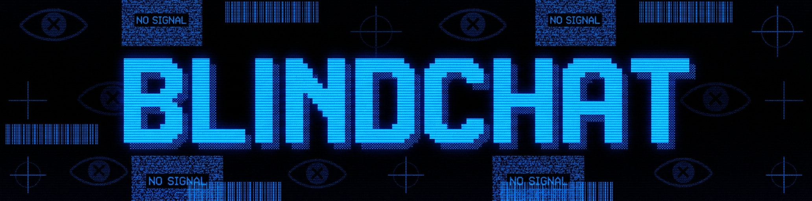
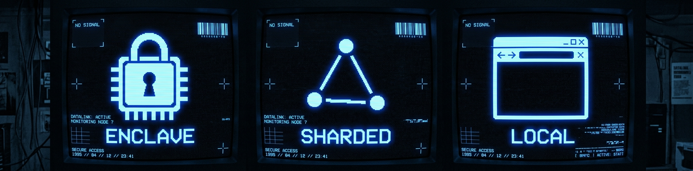

<div align="center">



# BlindChat

**Private chat with portable memory. The whole app runs in your browser — no backend, no provider that can read your prompts or your memory.**

[](LICENSE)
[](https://www.npmjs.com/package/blindcache-core)

</div>

---

## What is it

A chat client that combines three independent privacy primitives so that **no single party** in the chain can read your conversation or your memory.



| Layer | Where | What |
|---|---|---|
| **Inference** | Venice AI · TEE | LLM lives inside a Trusted Execution Environment. Nillion verifies the enclave via remote attestation before any prompt is sent. |
| **Memory** | [BlindCache](https://github.com/nikshepsvn/blindcache) · Nillion nilDB | Content is Shamir-shared across 4 operators on 3 continents. Operators must collude across jurisdictions to decrypt. |
| **Embeddings** | In-browser · Transformers.js | `Xenova/all-MiniLM-L6-v2` runs locally in your tab. Your text is never sent to an embedding API. |
| **Adapter** | Native or compat | Qwen3 models get native OpenAI function-calling; everything else uses an in-text marker protocol. Either way, every model can read + write the vault. |

---

## The interesting part: every model can use memory

Most chat clients gate memory tools to "models with function-calling support." Venice exposes that flag on only **4 of 15** of its TEE models — all Qwen3-family. BlindChat ships its own application-layer adapter so the other 11 models work too:

```
┌─────────────────────────────────────────────────────────────┐
│  User: "remember I prefer concise commit messages"          │
│                                                              │
│  Native path (Qwen3):                                        │
│    → API request includes `tools: [save_memory, ...]`       │
│    → Model emits a tool_call in the stream                  │
│    → We execute against the vault                           │
│    → Send tool result back, model replies "Saved."          │
│                                                              │
│  Compat path (GLM, GPT-OSS, Gemma, Venice, …):              │
│    → System prompt teaches a marker syntax                  │
│    → Model embeds [[SAVE]]{json}[[/SAVE]] in its reply      │
│    → Streaming filter buffers the marker out of view        │
│    → We parse + execute against the vault                   │
│    → For SEARCH, we send a 2nd turn with the result block   │
└─────────────────────────────────────────────────────────────┘
```

The user sees clean text either way. The badge in the input bar (`memory: native` or `memory: compat`) tells you which path is active.

### Four memory tools the LLM gets

| Tool | What |
|---|---|
| `save_memory(content, tags?)` | Persist a durable fact about the user |
| `search_memory(query, limit?)` | Semantic search over the vault |
| `list_recent_memories(limit?)` | Last N entries, newest first |
| `delete_memory(id)` | Permanently remove by id |

---

## What we're honest about


No privacy claim is unconditional. The three real footnotes:

| | Where it leaks | Why |
|---|---|---|
| **Metadata** | Any single nilDB operator | Tags, scope, timestamps live as plaintext so they're queryable. Content stays sharded, but the metadata around it is readable. |
| **Browser RAM** | Your tab | Anything typed sits in tab memory until you close it. Memory exfiltration via tab dumps is in scope for an attacker on your device. |
| **This page** | Attack surface | A malicious browser extension or compromised browser reads everything you do on this site. |

---

## You hold the keys


Two keys do all the work. Neither ever crosses our wire:

- **Venice key** — bearer token to your provider's enclave. Talks to Venice directly from your tab.
- **Nillion key** — signs NUC tokens for your nilDB shards. Your DID is derived from it.

**Preview status:** this version keeps both keys in `localStorage` (plaintext). A passkey-wrapped IndexedDB envelope is on the roadmap (see below).

---

## Run it locally

```bash
pnpm install
cp .env.example .env.local
# edit .env.local — add your Venice key from https://venice.ai/settings/api
pnpm dev
```

Opens at `http://localhost:3939`. On first load:

1. **Onboarding** explains the four privacy primitives.
2. **Setup** modal asks for your Venice key (validates it against `/v1/chat/completions` with a 1-token probe, then saves to IndexedDB).
3. The app auto-generates a fresh NUC private key and registers a new vault on Nillion testnet.
4. Everything from then on persists locally — chats, model selection, vault identity.

To start fresh: **Settings → Reset everything**. Or just clear site data in DevTools.

### Without an env var

In production (no env var set), the Setup modal collects the Venice key from the user. No defaults, nothing baked in. The `NEXT_PUBLIC_VENICE_API_KEY` env var is purely a dev-loop shortcut.

---

## Stack

- **Next.js 15** (App Router, static export)
- **React 19** with streaming UI
- **Tailwind v4** (`@theme` tokens, no rounded corners)
- **[`blindcache-core`](https://www.npmjs.com/package/blindcache-core)** — the encrypted vault SDK
- **[`@nillion/secretvaults`](https://www.npmjs.com/package/@nillion/secretvaults)** — Shamir-share storage across nilDB
- **[`@nillion/nuc`](https://www.npmjs.com/package/@nillion/nuc)** — secp256k1 signing for vault auth
- **[`@huggingface/transformers`](https://www.npmjs.com/package/@huggingface/transformers)** — in-browser embeddings (ONNX + WASM)
- **Venice AI** — OpenAI-compatible TEE + E2EE inference

The browser bundle does require some Node-polyfill plumbing (`stream-browserify`, `crypto-browserify`, `process/browser`, a `NormalModuleReplacementPlugin` for `node:` scheme, a postinstall symlink for `libsodium-wrappers-sumo`). See `next.config.ts` and `scripts/fix-libsodium.mjs`.

---

## What's shipped vs. what's left

### Shipped
- ✅ **Setup modal** — first-run UI to paste Venice key, validates against `/v1/chat/completions`, persists to IndexedDB
- ✅ **Settings panel** — view/change/remove Venice key, see Nillion identity, export + import JSON backup, reset everything (all with inline two-click confirms, no native dialogs)
- ✅ **Key recovery** — export NUC private key + collection ID as a downloadable JSON; import on a new device to restore the same vault
- ✅ **Multi-conversation** — sidebar threads, auto-titled from first user message, click to switch, hover-to-delete, persists across reloads
- ✅ **Strict CSP** — `script-src 'self' 'wasm-unsafe-eval'`, `connect-src` whitelist limited to Venice + Nillion testnet + HF, `frame-ancestors 'none'`, HSTS
- ✅ **Reasoning model timeouts** — 90s per-turn AbortController + friendly error messages for 504 / 401 / 403
- ✅ **Mobile responsive** — sidebar + memory panel become drawer sheets below 768px, top bar with ☰ and ▤ toggles
- ✅ **Loading skeletons** — pulsing placeholder cards in MemoryPanel while the vault opens, status indicator in chat empty state
- ✅ **Tool-calling adapter** — every Venice model can read + write the vault (Qwen3 via native function calling, the rest via the marker protocol)
- ✅ **IndexedDB storage** — all keys + conversations + flags live in IDB (no more localStorage)

### Still on the roadmap

- **Passkey-wrapped key storage** — WebAuthn `deriveKey` → AES-GCM the NUC + Venice keys at rest. The onboarding promises this; today the keys are plaintext-at-rest in IndexedDB (same threat model as localStorage). A real ship needs this. Deferred because the recovery story (lost passkey → lost vault) needs careful UX work.
- **Vault node failover** — if a nilDB node goes down, do we fall back to the remaining two? Currently inherits whatever `@nillion/secretvaults` does. Worth a real test.
- **Memory CRUD UI** — today only the LLM can mutate the vault via tool calls. A panel-side edit/pin/delete would help users curate.
- **E2E tests** — Playwright for the critical flows (save/search in both memory modes, key recovery, multi-conversation persistence).
- **Bundle analyzer + lazy-load** — the 23 MB Transformers.js model dominates the bundle; lazy-load it until first vault operation.
- **GitHub Actions** — lint/typecheck/build + preview deploys per PR.

---

## License

Apache 2.0 — see [LICENSE](LICENSE).
